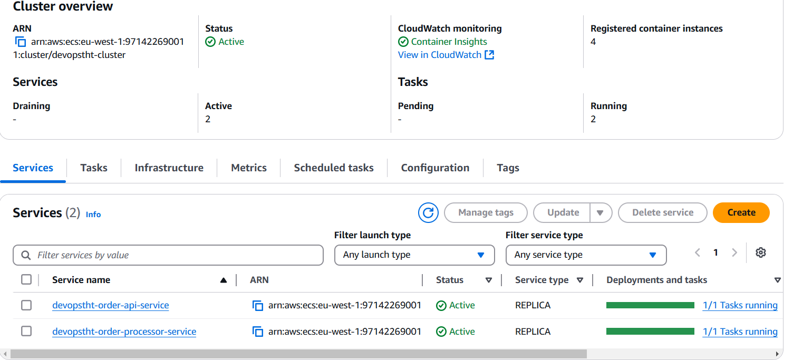
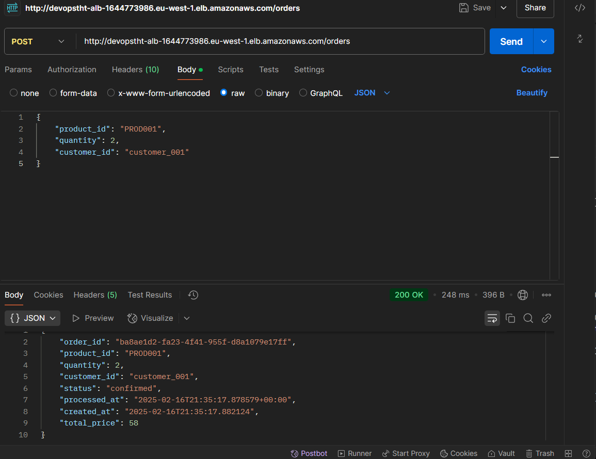
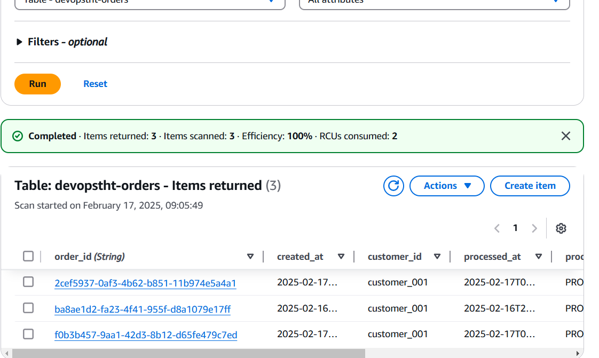
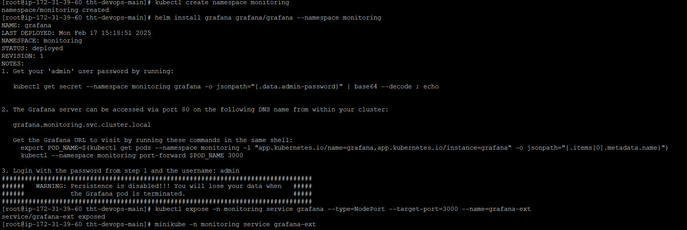

# Terraform and ECS-EC2 cluster
## How to deploy
- First, we need to create ECR repositories via Terraform. I have added a Makefile for this purpose at deliverables/deploy/ecr/terraform/Makefile. Run make tf-ecr-init, and then make tf-ecr-apply. This will ensure that the OrderProcessor and Order API repositories are created.
- Use the upload.sh script in deliverables/deploy/upload.sh to build and upload ECR images for the Order API and Order Processor.
- Next, we need to deploy the ECS on EC2 resources in the repository deliverables/deploy/ecs-ec2.
- Run the make commands tf-cluster-init and tf-cluster-apply to deploy the resources on ECS on EC2.
## How to Test 
- Ensure backend is healthy and working and service connect service discovery works

- Make a POST request to the loadbalancer endpoint 

- Check if a new order is created in the DynamoDB orders table and if the inventory table is updated accordingly. 
 
- Make a GET request to fetch the order

# Kubernetes and Helm
## How to deploy to MiniKube
- Go to the root of the repository run make helm-apply
- Seed the dynamoDB with the instructions mentioned in MINIKUBE.md
- Install monitoring tools Grafana and Prometheus

## How to Test 
- Check pods service and deployment are working as expected 

- The Order Api service is expose as NodePort so fetch the minikube ip and make a POST request

- Do a Get request to fetch the orders by passing order id as query parameter.
- Make sure monitoring setup is working as expected
