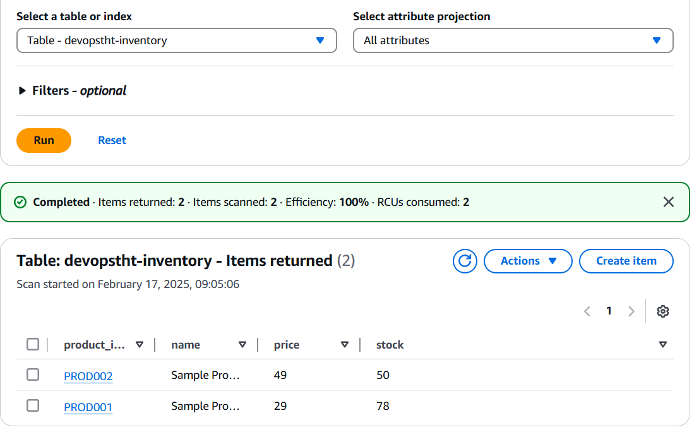

# Terraform and ECS-EC2 cluster
## How to deploy
- First we need to create ecr repos via terraform I had added a makefile for the same at 
    deliverables/deploy/ecr/terraform/Makefile run make tf-ecr-init and then make tf-ecr-apply this will ensure orderprocessor and order api repos are created
- Use upload.sh script in deliverables/deploy/upload.sh to  build and upload ECR images for order-api and order processor
- Then we need to deploy the ecs on ec2 resources in the repo deliverables/deploy/ecs-ec2
- run the make commands tf-cluster-init and tf-cluster-apply to deploy the resources on ecs on ec2
## How to Test 
- Make a curl request on loadbalancer endpoint 

- Check if new order is created in dynamodb table for orders and the inventory table is updted as per the orders 
 

# Kubernetes and Helm
## How to deploy to MiniKube
- 

## How to Test 
- 